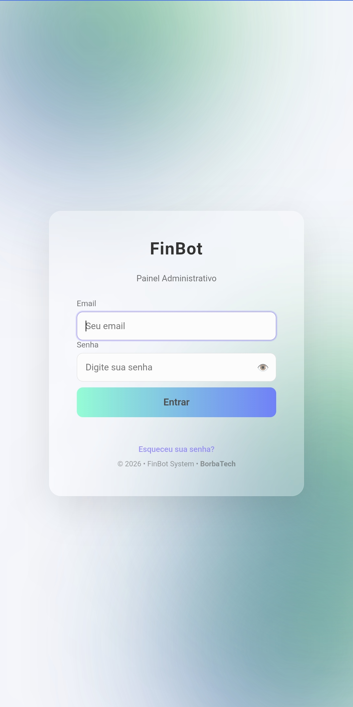
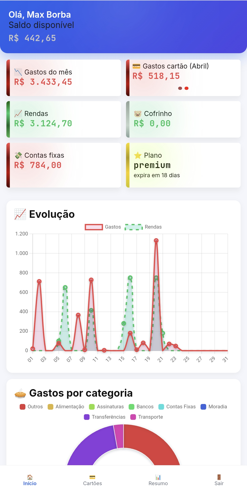
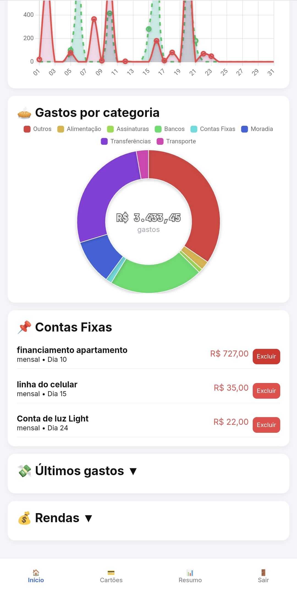
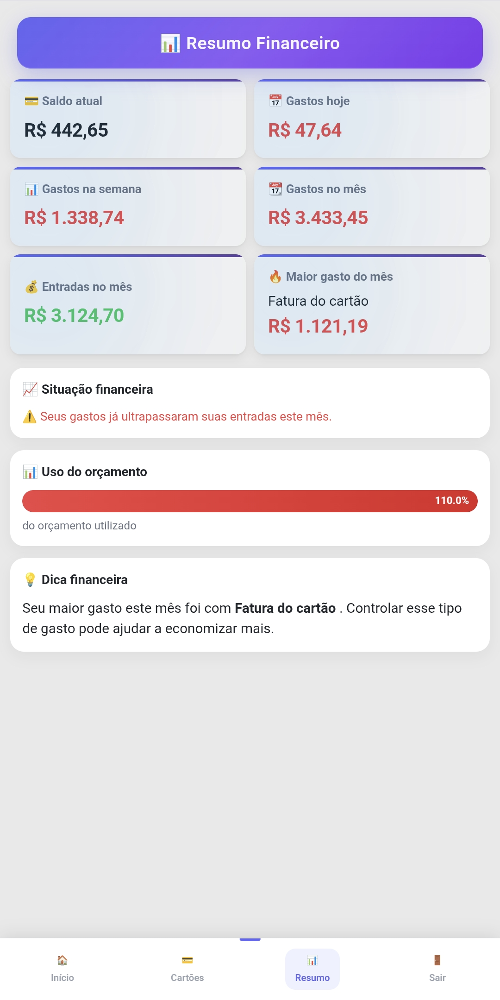

# 🤖 FinBot — Agente Financeiro Inteligente

O **FinBot** é um agente financeiro que permite gerenciar suas finanças de forma prática diretamente pelo **WhatsApp**, com suporte a **gastos, rendas, cartões, contas fixas, relatórios e painel web administrativo**.


---

## 🚀 Visão Geral

O FinBot foi desenvolvido para centralizar o controle financeiro em um único lugar, utilizando uma interface simples: **mensagens no WhatsApp**.

A aplicação combina:

- 📲 Entrada de dados via WhatsApp  
- 🧠 Processamento com Python  
- 📊 Visualização em painel web  
- 💳 Integração com pagamentos (PIX)  


---


## 📸 Demonstração

### 🔐 Tela de Login


### 📊 Dashboard Principal


### 📈 Análises e Gráficos


### 📋 Resumo Financeiro


---

## 🚀 Status do Projeto

O **FinBot** está atualmente em **produção ativa**, sendo utilizado em ambiente real para controle financeiro.

📅 Previsão de operação: até **04 de junho de 2026**

> ⚠️ Projeto em evolução contínua, podendo receber melhorias, ajustes e novas funcionalidades.

---

## 🎯 Objetivo do Projeto

- Automatizar o controle financeiro pessoal  
- Simplificar o registro de gastos e rendas  
- Centralizar informações financeiras  
- Servir como base para evolução futura  

---

## 👤 Público-Alvo

- Usuários que desejam controlar suas finanças de forma simples  
- Uso pessoal ou projetos experimentais  

---

## ⚙️ Funcionalidades

### 💸 Financeiro
- Registro de gastos e rendas via WhatsApp  
- Ajuste manual de saldo e salário  
- Controle de cofrinho (reserva financeira)  

### 💳 Cartão de Crédito
- Registro de compras à vista e parceladas  
- Cadastro e seleção de cartões  
- Geração de fatura em PDF  

### 📆 Contas Fixas
- Cadastro com periodicidade (mensal, semanal, anual)  
- Listagem e remoção de contas  

### 📊 Relatórios
- Diário, semanal e mensal  
- Relatório avançado  

### 🔐 Conta do Usuário
- Recuperação de senha via email  
- Consulta de plano (Free/Premium)  

### 💎 Monetização
- Upgrade para plano Premium com pagamento via PIX  

### 🖥️ Painel Web
- Acesso ao painel financeiro online  
- Visualização de dados e gráficos  

---

## 💬 Comandos do Bot

### 📘 Gerais
- `/menu` → Menu principal  
- `/comandos` → Lista de comandos  
- `/ajuda` → Instruções  

---

### 💸 Financeiro
- `gastei VALOR DESCRIÇÃO` → Registrar gasto  
- `recebi VALOR DESCRIÇÃO` → Registrar renda  
- `/saldo` → Ver saldo atual  

---

### 💳 Cartão
- `cartao VALOR DESCRIÇÃO` → Registrar gasto no cartão  
- `/novocartao` → Cadastrar cartão  
- `/cartoes` → Listar cartões  
- `/fatura` → Gerar fatura PDF  

---

### 📆 Contas Fixas
- `/contafixa` → Criar conta fixa  
- `/fixas` → Listar contas  
- `/removerconta` → Remover conta  

---

### 🐷 Cofrinho
- `/cofrinho VALOR` → Guardar dinheiro  
- `/attcofre VALOR` → Atualizar total  

---

### 📊 Relatórios
- `/dia` ou `/hoje` → Diário  
- `/semanal` → Semanal  
- `/mensal` → Mensal  
- `/avancado` → Completo  

---

### ⚙️ Ajustes
- `/attsaldo` → Ajustar saldo  
- `/attsalario` → Ajustar salário  

---

### 🔐 Conta
- `/recuperarsenha` → Recuperar senha  
- `/plano` → Ver plano  

---

### 💎 Premium
- `/upgrade` → Ativar plano Premium  

---

## 🧩 Arquitetura

- **Node.js** → Integração com WhatsApp  
- **Python** → Lógica de negócio  
- **Flask** → Painel web  
- **SQLite** → Banco de dados  

---

## 📁 Estrutura do Projeto

```
finbot-borba-tech/
├── backend/
├── whatsapp_bot/
├── docs/
├── requirements.txt
└── README.md
```

---

## 🔐 Variáveis de Ambiente

Este projeto utiliza variáveis de ambiente para armazenar dados sensíveis.

### 📄 Crie um arquivo `.env` na raiz do projeto com o seguinte conteúdo:

```env
ENV=development
DEBUG=True

BASE_URL=http://localhost:5001

SECRET_KEY=sua_chave_secreta_aqui

#Email e senha de login do painel administrativo 

EMAIL_USER=seu_email@gmail.com
EMAIL_PASSWORD=sua_senha_de_app

# DATABASE 
DB_PASSWORD=sua_senha

# MERCADO PAGO
MP_ACCESS_TOKEN=seu_token_aqui
```
---

## ▶️ Como Executar

### 1. Clonar

```
git clone https://github.com/Maxborbadev/finbot-borba-tech
cd finbot-borba-tech
```

---

### 2. Ambiente virtual

```
python -m venv venv
```

Ativação:

```
venv\Scripts\activate
```

---

### 3. Instalar dependências

```
pip install -r requirements.txt
```

---

### 4. Rodar backend

```
cd backend
python app.py
```

---

### 5. Rodar bot

```
cd whatsapp_bot
npm install
node baileys_bot.js
```

---

## 🖥️ Painel Web

```
http://localhost:5000/admin
```

---

## ⚠️ Limitações

- Não utiliza API oficial do WhatsApp  
- 
- Dependência de QR Code para login  ( apenas na primeira vez que for conectar )

---

## 🚀 Diferenciais

- Interface via WhatsApp  
- Sistema financeiro completo  
- Integração com pagamento via PIX  
- Arquitetura modular e escalável  

---

## 👨‍💻 Desenvolvedor

**Max Borba**  
Borba Tech  

---

### ⭐ Se este projeto te ajudou, deixe uma estrela no repositório
